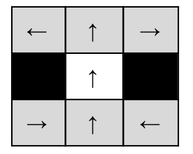
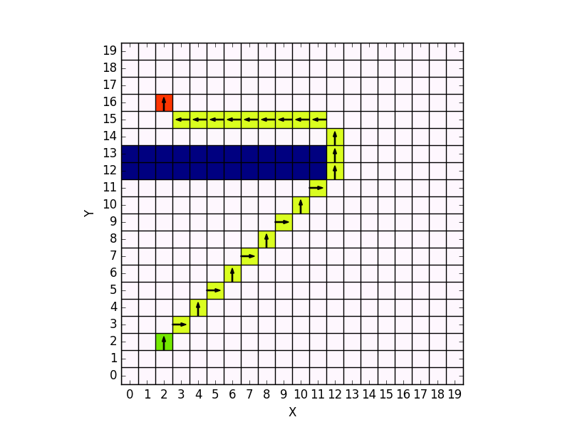
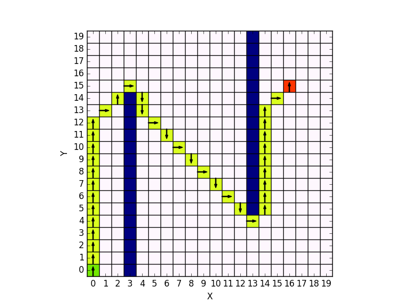

# Path Finding with A* algorithm

This project is an implementation of the A* algorithm for a path finding application, in a 2 dimensional grid but taking into account the orientation of the robot.

## Context

A robot needs to move from a starting position with a certain orientation to a goal position with a certain orientation, while avoiding the obstacles.
The robot cannot do a 90° turn while staying at the same position. The robot can only move in 6 possible directions, according to the following movement model:



## Some results

 | 


## Usage

```python
cd path_finding/
python main_path_finder.py
```

The ```main_path_finder.py``` script is where you can modify the tests launched.


## References
1. [A* search algorithm on Wikipedia](https://en.wikipedia.org/wiki/A*_search_algorithm#Pseudocode)
2. [Pathfinding with A* on Red Blob Games](http://www.redblobgames.com/pathfinding/a-star/introduction.html)
3. [Motion Planning lecture](https://www.cs.cmu.edu/~motionplanning/lecture/AppH-astar-dstar_howie.pdf)
4. [Summary of the A* Algorithm](http://robotics.caltech.edu/wiki/images/e/e0/Astar.pdf)
5. [A* search algorithm explanation](https://towardsdatascience.com/a-star-a-search-algorithm-eb495fb156bb)
